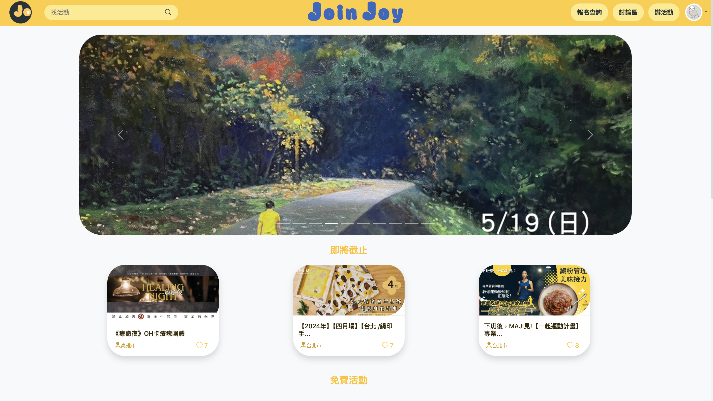

# JoinJoy

> JoinJoy 是一個活動平台，使用者可以報名參與活動、發起活動以及發起討論文章，透過共同平台讓有相同興趣的各位有更多相遇的機會。專案有放在 Azure 雲端上（因為是試用所以隨時會無法使用），並在 namecheap 購買網域，可以點選[連結](https://joinjoy.fun/)到我們網站瀏覽。
> 
- [線上觀看連結](https://joinjoy.fun)



## 功能

> 我開發功能為，會員的登入/註冊/忘記密碼，是以 Spring Security 框架下開發，除了會員註冊可以選擇原本網站的註冊，也可以選擇第三方 Google 帳號登入/註冊，並在網站的設有帳號認證權限管制；且結合 Redis 來存取信箱OTP驗證碼的功能，加上驗證碼的時效以及次數限制。
> 

測試帳號密碼

```bash
帳號： ispan3939889@gmail.com
密碼： password2

```

## 畫面

> 首頁
> 


> 登入/註冊/忘記密碼
> 


> 第三方登入（Google）
> 


## 專案技術

> 使用的 Java 版本為 17；Spring Boot 版本為 3.2.3；建置工具使用 Maven。
> 
- 前端
    - Vue v3.4.21
    - Axios v1.6.8
    - Bootstrap v5.2.3
    - ...
- 後端
    - JDK 17
    - Spring Boot v3.2.3
    - Spring Security
    - Hibernate
    - Spring Mail
    - ...

## 資料庫

- MS SQL
- Redis

## 第三方服務

- Google OAuth
- ...

## 聯絡作者

你可以透過以下方式與我聯絡

- [LinkedIn](https://www.linkedin.com/in/bo-chen-lin-a0b429224/)
- [104人力銀行](https://pda.104.com.tw/profile/share/8sdVprJszq4NlKZQujkViUZQMwnAjWRn)
- ...

